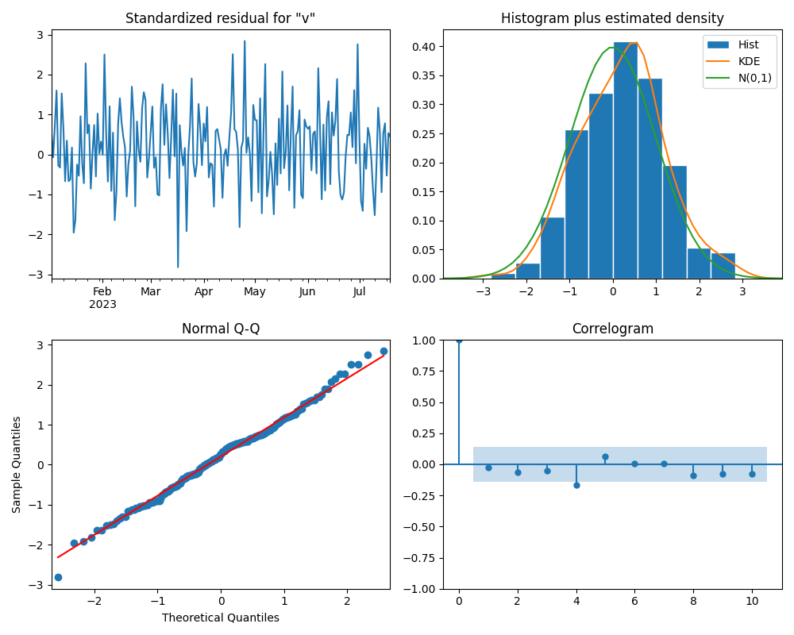

# ARIMA (Autoregressive Integrated Moving Average)

## 1. Introduction
ARIMA is the gold standard for statistical time series forecasting. It models a time series based on its own past values (Autoregression), its own past errors (Moving Average), and ensures stationarity through differencing (Integrated).

## 2. Historical Context
*   **The Inventors:** George Box and Gwilym Jenkins (1970) in their classic book "Time Series Analysis: Forecasting and Control".
*   **Significance:** The "Box-Jenkins Method" provided a systematic way to identify, estimate, and check models for time series, dominating the field until the rise of Deep Learning (RNNs/LSTMs).

## 3. Real-World Analogy
### The Weather Forecaster
*   **Autoregression (AR):** "It was hot yesterday (30°C) and the day before (29°C), so it will likely be hot today." (Using past values).
*   **Integrated (I):** "The temperature is rising by 1 degree every day." (Removing the trend to make the series stable/stationary).
*   **Moving Average (MA):** "Yesterday I predicted 28°C but it was 30°C (Error = +2). I should adjust my prediction today to account for this shock." (Using past forecast errors).

## 4. Mathematical Foundation
An ARIMA(p, d, q) model has three parameters:
1.  **p (AR order):** Number of lag observations included in the model.
    $$ Y_t = c + \phi_1 Y_{t-1} + \dots + \phi_p Y_{t-p} + \dots $$
2.  **d (I order):** Number of times that the raw observations are differenced.
    $$ Y'_t = Y_t - Y_{t-1} $$
3.  **q (MA order):** Size of the moving average window (lagged forecast errors).
    $$ Y_t = \mu + \epsilon_t + \theta_1 \epsilon_{t-1} + \dots + \theta_q \epsilon_{t-q} $$

## 5. Implementation Details
*   **`01_arima.py`**: Uses the `statsmodels` library to fit an ARIMA model to a synthetic dataset (Trend + AR noise).
    *   **Data Generation:** Creates a time series with a linear trend and autoregressive noise.
    *   **ACF/PACF:** Plots Autocorrelation and Partial Autocorrelation functions to help identify p and q.
    *   **Forecasting:** Predicts future values with confidence intervals.
    *   **Diagnostics:** Checks residuals to ensure they are white noise (random).

## 6. Limitations
*   **Linearity:** ARIMA assumes linear relationships. It struggles with complex non-linear patterns (where LSTMs shine).
*   **Univariate:** Standard ARIMA only uses the time series itself, not external variables (though ARIMAX exists).

## 7. Results

### Data Analysis

*The synthetic time series showing a clear upward trend.*

### ACF & PACF

*Autocorrelation and Partial Autocorrelation plots used to determine the order of AR and MA terms.*

### Forecast

*The model's forecast (red) with confidence intervals (pink) against the observed data.*

### Diagnostics

*Residual analysis to ensure the model has captured all patterns (residuals should look like white noise).*

