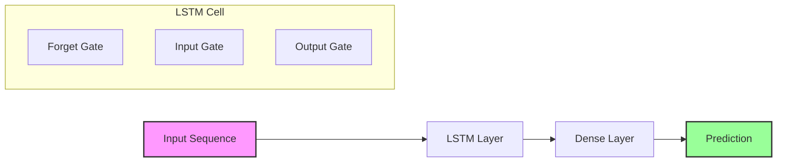
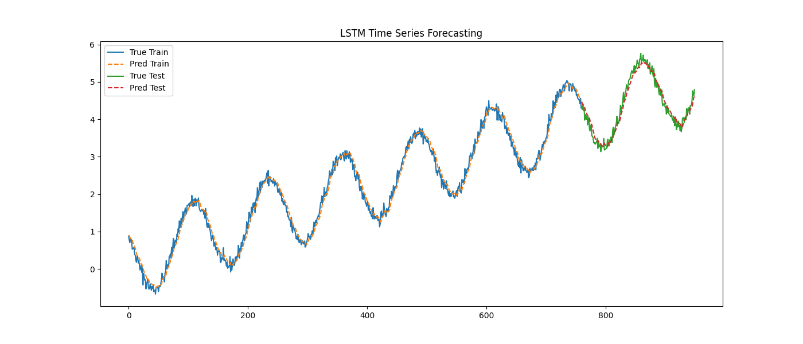

# LSTM for Time Series Forecasting

## 1. Executive Summary
**Long Short-Term Memory (LSTM)** networks are a type of Recurrent Neural Network (RNN) capable of learning order dependence in sequence prediction problems. Unlike standard RNNs, LSTMs have a "memory cell" that can maintain information in memory for long periods of time, making them ideal for time series data where lags of unknown duration matter.

## 2. Historical Context
*   **Hochreiter & Schmidhuber (1997)**: Introduced LSTM to solve the vanishing gradient problem in traditional RNNs.
*   **Significance**: LSTMs became the state-of-the-art for sequence modeling (speech recognition, translation, time series) until the Transformer architecture gained popularity in NLP, though LSTMs remain highly effective for numerical time series.

## 3. Real-World Analogy
**The Diary**
*   **Standard RNN**: Like a person with short-term memory loss. They read a sentence but forget the beginning by the time they reach the end.
*   **LSTM**: Like a person keeping a diary.
    *   **Forget Gate**: Decides what information from yesterday is no longer relevant (cross it out).
    *   **Input Gate**: Decides what new information is important enough to write down today.
    *   **Cell State**: The diary itself, carrying core memories across time.

## 4. Mathematical Foundation
The core of LSTM is the cell state $C_t$ and the gates:
1.  **Forget Gate**: $f_t = \sigma(W_f \cdot [h_{t-1}, x_t] + b_f)$
2.  **Input Gate**: $i_t = \sigma(W_i \cdot [h_{t-1}, x_t] + b_i)$
3.  **Candidate Update**: $\tilde{C}_t = \tanh(W_C \cdot [h_{t-1}, x_t] + b_C)$
4.  **Cell Update**: $C_t = f_t * C_{t-1} + i_t * \tilde{C}_t$
5.  **Output Gate**: $o_t = \sigma(W_o \cdot [h_{t-1}, x_t] + b_o)$
6.  **Hidden State**: $h_t = o_t * \tanh(C_t)$

## 5. Architecture



## 6. Implementation Details
The repository contains:
*   `01_lstm_ts.py`: Uses `torch.nn.LSTM`.
    *   **Data Preparation**: Converts a time series into a supervised learning problem using a sliding window (lookback).
    *   **Model**: A simple LSTM followed by a Linear layer.
    *   **Training**: Optimizes Mean Squared Error.

## 7. How to Run
Run the script from the terminal:

```bash
python 01_lstm_ts.py
```

## 8. Implementation Results

### Data
The sine wave data used for training.


### Forecast
The LSTM's prediction (red) closely tracks the actual sine wave (blue), demonstrating its ability to learn periodic patterns.


## 9. References
*   Hochreiter, S., & Schmidhuber, J. (1997). *Long short-term memory*. Neural computation.
