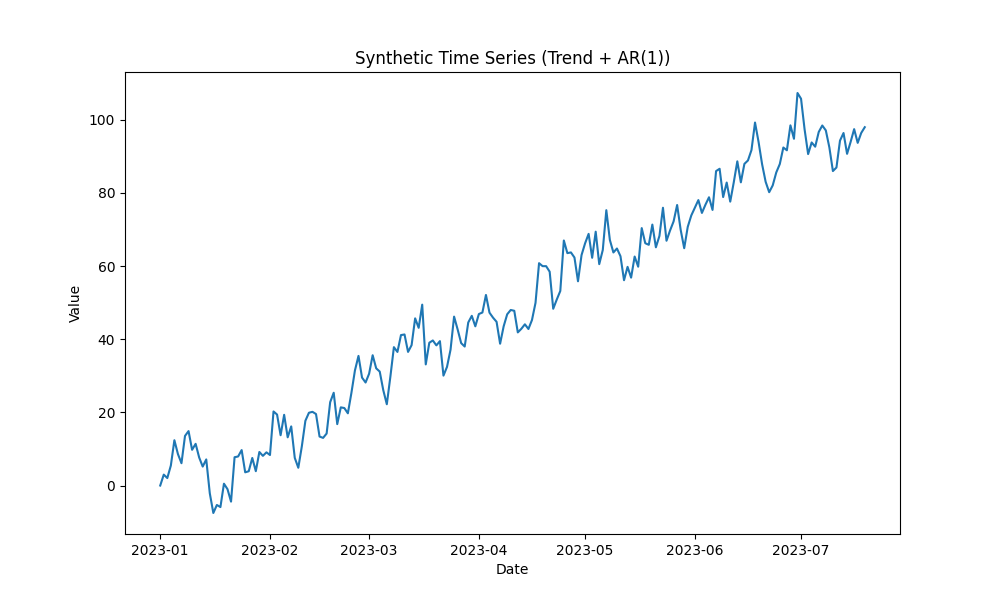
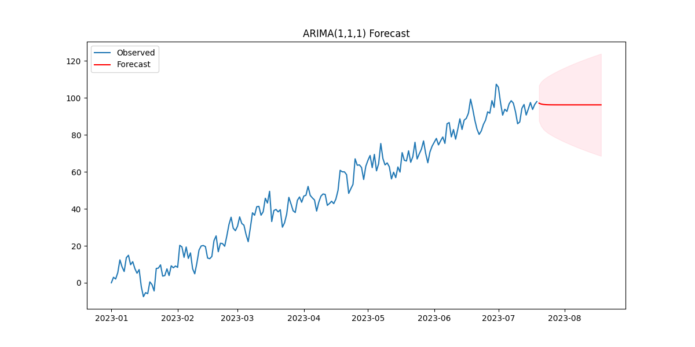

# ARIMA (AutoRegressive Integrated Moving Average)

## 1. Executive Summary
**ARIMA** is the gold standard for statistical time series forecasting. It combines three components: **AR** (AutoRegressive) which uses past values to predict future ones, **I** (Integrated) which handles non-stationarity by differencing the data, and **MA** (Moving Average) which uses past forecast errors. It is best suited for univariate time series with linear relationships.

## 2. Historical Context
*   **Box-Jenkins Method (1970)**: George Box and Gwilym Jenkins formalized the process of identifying, estimating, and checking ARIMA models. Their work made ARIMA the dominant method for decades before the rise of machine learning.

## 3. Real-World Analogy
**Driving a Car**
*   **AR (AutoRegressive)**: You look in the rear-view mirror. Your position 1 second ago strongly predicts your position now.
*   **I (Integrated)**: If you are accelerating (non-stationary speed), you look at the *change* in speed (acceleration) to understand the motion.
*   **MA (Moving Average)**: You adjust your steering based on the "shock" or error you made in the previous second (e.g., a gust of wind pushed you slightly off course).

## 4. Mathematical Foundation
An ARIMA(p, d, q) model is defined by:
*   **p**: Order of the AR part.
*   **d**: Degree of differencing.
*   **q**: Order of the MA part.

The equation is:
$$ Y_t = c + \phi_1 Y_{t-1} + ... + \phi_p Y_{t-p} + \theta_1 \epsilon_{t-1} + ... + \theta_q \epsilon_{t-q} + \epsilon_t $$
Where $Y_t$ is the differenced series (if $d>0$).

## 5. Architecture

```mermaid
graph LR
    Raw[Raw Data] --> Diff{Stationarity Check}
    Diff -- Not Stationary --> Difference[Difference Data (d)]
    Difference --> Diff
    Diff -- Stationary --> AR[AutoRegressive (p)]
    Diff -- Stationary --> MA[Moving Average (q)]
    AR --> Combine[Combine AR & MA]
    MA --> Combine
    Combine --> Forecast[Forecast]
    
    style Raw fill:#f9f,stroke:#333,stroke-width:2px
    style Forecast fill:#9f9,stroke:#333,stroke-width:2px
```

## 6. Implementation Details
The repository contains:
*   `01_arima.py`: Uses `statsmodels.tsa.arima.model.ARIMA`.
    *   Generates a synthetic time series with trend and seasonality.
    *   Performs differencing to achieve stationarity.
    *   Fits an ARIMA model.
    *   Forecasts future steps.

## 7. How to Run
Run the script from the terminal:

```bash
python 01_arima.py
```

## 8. Implementation Results

### Raw Data
The synthetic data showing a clear trend and seasonality.


### Diagnostics (ACF/PACF)
Autocorrelation and Partial Autocorrelation plots used to determine parameters $p$ and $q$.


### Forecast
The model's prediction (red) vs the actual future values.


## 9. References
*   Box, G. E., & Jenkins, G. M. (1970). *Time series analysis: forecasting and control*.
